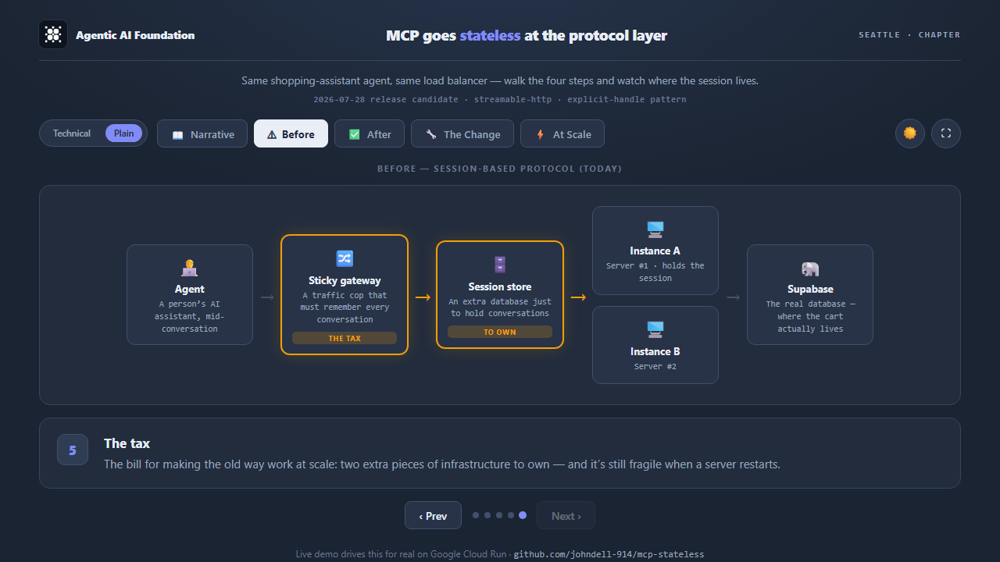
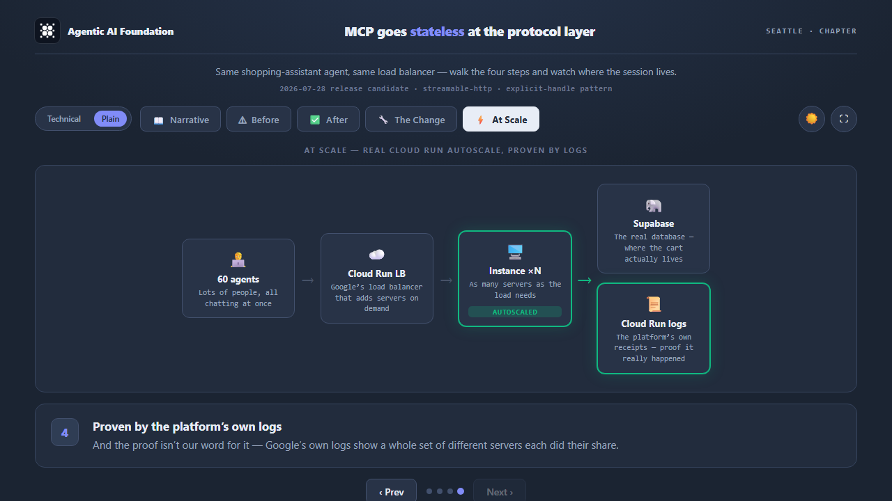
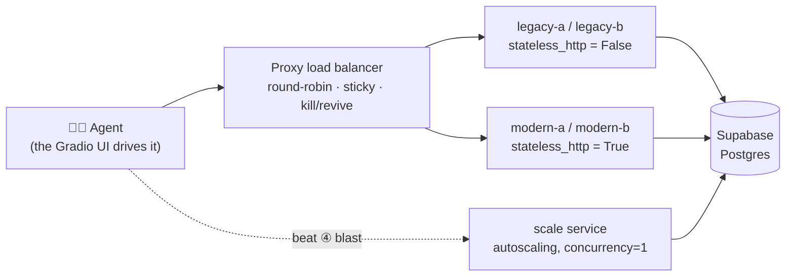

# MCP goes stateless — a live before/after demo

A working demonstration of the change introduced in the **Model Context Protocol
`2026-07-28` release candidate**: MCP becomes **stateless at the protocol layer**. The
`initialize` handshake and the `Mcp-Session-Id` header are gone, so a server that used to
need **sticky routing + a shared session store** to scale can now run behind a plain
round-robin load balancer — *any request can land on any instance*.

This repo shows that shift two ways: an **interactive diagram** you can open in a browser,
and a **live demo** that drives real MCP servers on Google Cloud Run and proves the behavior
with the platform's own logs.



> `<Agent> → <Sticky gateway> → <Session store> → <instances> → <Postgres>` — everything
> in amber is the operational tax the old protocol forced on you. The new protocol deletes it.

---

## The thesis

You build an MCP server. It works on your laptop. Then you deploy it for 50,000 users.

Every agent conversation is a **session**. Under the old protocol the server minted a session
id on `initialize`, and that session lived in **one instance's memory**. Put two instances
behind a load balancer and the agent's next tool call lands on the other one — *"Session not
found."* To cope you bolt on **sticky routing** and a **shared session store**, and when a pod
recycles, live agents drop mid-task.

The `2026-07-28` protocol makes MCP stateless: state moves into an **explicit token** the
client carries as a tool argument (`cart_token`), so any instance can serve any request. The
migration is two lines — because the app state was already explicit; the protocol was just
forcing a session on top of it.

This demo uses a tiny **shopping-cart** MCP server (`create_cart` / `add_item` / `get_cart`) —
exactly the shape of a real agentic-commerce server (Shopify, Stripe, and others ship remote
MCP servers today). The tools never change between "before" and "after"; only the protocol flag
and the client mode do.

---

## What's in the box

| Surface | What it is | How to view |
| --- | --- | --- |
| **Interactive diagram** | Self-contained HTML — Narrative / Before / After / The Change / At Scale / Request Flow tabs, a Technical⇄Plain toggle, light/dark + fullscreen | Open [`MCP-STATELESS-DEMO.html`](MCP-STATELESS-DEMO.html) in any browser (no build, no network) |
| **Code map** | Self-contained HTML — an architecture diagram of `src/mcp_stateless_demo` (Modules / Tool call / Log proof tabs) for ramping on the code | Open [`mcp-stateless_architecture.html`](mcp-stateless_architecture.html) in any browser |
| **Live demo** | A Gradio app that drives real MCP servers on Cloud Run and shows live results + real Cloud Run logs | Run locally (below) or deploy your own |

### The demo, beat by beat

The live demo walks a guided story with the **same three tools** each time:

1. **① Scale it** — round-robin over two instances → *"Session not found."* The break, proven by real `404`s across two instance IDs in the logs.
2. **② Add the tax** — turn on sticky routing (+ a session store in the diagram) → it works, but you now own a session-aware gateway and an external store.
3. **💥 Recycle a pod** — with sticky on, recycle the instance holding a live session → the agent **drops mid-task**.
4. **③ Go stateless** — flip the protocol → every request succeeds across instances, nothing extra to own.
5. **④ Prove it at scale** — blast 60 concurrent agents at a real autoscaling service → Cloud Run fans out to N instances, every request green, proven by the platform's own instance IDs in the logs.



---

## The change — it's two lines

```diff
# server
- streamable_http_app(stateless_http=False)
+ streamable_http_app(stateless_http=True)

# client
- Client(url, mode="legacy")
+ Client(url, mode="auto")
```

The tool bodies are byte-identical across both modes. The cart always lives in Postgres,
addressed by a signed, opaque `cart_token` the client passes back — that's why the migration
is so small.

---

## How it works

The demo runs as several small services so a load balancer can genuinely round-robin across
*distinct process memories*:



- **`server/`** — a `MCPServer` exposing the three cart tools. The *entire* per-act difference
  is one flag (`stateless_http`); everything else is constant.
- **`proxy/`** — a deterministic reverse proxy: plain round-robin, or *learned* sticky affinity
  (session-id → instance), plus `/kill` + `/revive` for the recycle beat. This is the "load
  balancer / session-aware gateway" the audience watches.
- **`cart/`** — the domain: the `cart_token` codec (HMAC-signed handle), the store `Protocol`,
  and the Postgres store.
- **`client/`** — the `ActRunner` that drives scripted acts (and the 60-way blast) through the
  proxy and returns structured rows.
- **`cloud/`** — reads real Cloud Run stdout logs so the UI can *prove* an event happened on
  real infrastructure.
- **`ui/`** — the Gradio app (thin wiring) and the pure HTML panel renderers.

App state lives in Postgres (it survives instance churn); the client carries only a signed
reference to a row. Row Level Security / anon keys aren't involved — the server connects
directly with `asyncpg`.

---

## Anatomy of a tool call

Trace one request end-to-end and the codebase falls into place. Here's `add_item`:

```mermaid
sequenceDiagram
    participant A as Agent · client/runner.py
    participant P as Proxy · proxy/app.py
    participant S as MCP server · server/tools.py
    participant T as Token · cart/token.py
    participant DB as Postgres · cart/store_postgres.py
    A->>P: POST /mcp — tools/call add_item {cart_token, name, qty}
    P->>S: forward (round-robin / sticky; reads mcp-session-id)
    S->>T: codec.decode(cart_token) → verify HMAC → cart_id
    S->>DB: update carts set items = items || $2 where id = cart_id
    DB-->>S: updated items
    S-->>A: {served_by, cart_token, items}
```

1. **Agent** — [`client/runner.py`](src/mcp_stateless_demo/client/runner.py) opens `Client(url, mode=…)` and calls `client.call_tool("add_item", {…})`; the MCP SDK serializes a JSON-RPC `tools/call` and POSTs it over streamable HTTP. In stateless mode there's no `initialize`/session-id handshake.
2. **Proxy** — [`proxy/app.py`](src/mcp_stateless_demo/proxy/app.py) reads one header (`mcp-session-id`), `state.pick()`s an instance (round-robin or learned sticky), and forwards the raw bytes.
3. **Server** — [`server/tools.py`](src/mcp_stateless_demo/server/tools.py) runs the `@server.tool()` function. With `stateless_http=False` the transport first checks the session belongs to *this* instance (a `404 "Session not found"` otherwise — that's the "before" break, before your tool even runs).
4. **Token** — [`cart/token.py`](src/mcp_stateless_demo/cart/token.py) re-signs the id and `compare_digest`s it, then returns the `cart_id` (a client can't forge one it wasn't given).
5. **Store** — [`cart/store_postgres.py`](src/mcp_stateless_demo/cart/store_postgres.py) appends the item with a jsonb `||` and returns the updated cart.

`create_cart` is the same path minus the decode: it `insert`s a row (`store.create()`) and returns `codec.encode(cart_id)` — the signed handle the client carries into every later call.

**Why this shape matters:** `add_item` needs *nothing* from server memory — the `cart_token` + Postgres hold all the state, so any instance can serve any call. That's the explicit-handle pattern, and it's why flipping `stateless_http` is a two-line change rather than a rewrite. (The interactive diagram's **Request Flow** tab walks this same sequence visually.)

---

## Prerequisites

| To run… | You need |
| --- | --- |
| The two diagrams | Just a browser — both `.html` files are self-contained. |
| The live demo locally | [Docker](https://docs.docker.com/get-docker/) and a Postgres database — [Supabase](https://supabase.com)'s free tier is what this repo assumes. |
| The dev tooling / smoke test | [uv](https://github.com/astral-sh/uv) and Python 3.11+. |
| The **full** demo (real autoscale + live logs) | A Google Cloud project with billing and the [`gcloud` CLI](https://cloud.google.com/sdk/docs/install) — see [Deploy to Cloud Run](#deploy-to-cloud-run). |

## Run it locally

```bash
# 1. configure
cp .env.example .env
#    fill DATABASE_URL (Supabase session-pooler URI, port 5432) and TOKEN_SECRET:
#    python -c "import secrets; print(secrets.token_urlsafe(32))"

# 2. create the table
psql "$DATABASE_URL" -f deploy/db/schema.sql      # or paste it into the Supabase SQL editor

# 3. run the whole stack (2 legacy + 2 modern servers, the proxy, the UI)
docker compose up --build
```

Then open **http://localhost:7860** and walk the beats.

Want a headless sanity check first? `uv run python scripts/smoke.py` spins up a
2-instance cluster in-process against your database and asserts the thesis
(BEFORE = all-red, AFTER = all-green) — the fastest way to confirm your `DATABASE_URL` works.

> **What runs locally vs. what needs Cloud Run.** `docker compose up` is a real
> multi-instance stack, so beats ①–③ — the scale break, the sticky tax, the mid-task
> drop, and going stateless — all work locally against distinct process memories. Beat
> ④ (the *real* autoscale blast) and the live Cloud Run log panels need a deployed
> autoscaling service and log access; locally they degrade to a friendly "no logs"
> placeholder. **To present the full story, including the autoscale proof, deploy to
> Cloud Run first.**

## Presenting the demo

Put two things on screen: the **live demo** (your local or deployed UI) and the
**interactive diagram** ([`MCP-STATELESS-DEMO.html`](MCP-STATELESS-DEMO.html)) in a second
window. Click a beat in the app, then switch the diagram to the matching tab so the
audience watches the architecture change as the behavior changes.

| Beat (button) | Diagram tab | The line to land |
| --- | --- | --- |
| **① Scale it** | Before | Round-robin + the old session protocol = *Session not found* — proven by real `404`s across two instance IDs. |
| **② Add the tax** | Before | Sticky routing fixes it, but now you own a session-aware gateway and a shared store. |
| **💥 Recycle a pod** | Before | With sticky on, recycle the pod holding a live session and the agent drops mid-task. |
| **③ Go stateless** | The Change → After | Flip one flag; every request succeeds across instances, nothing extra to own. |
| **④ Prove it at scale** | At Scale | 60 concurrent agents at a real autoscaling service — Cloud Run fans out to N instances, all green, proven by the platform's own instance IDs. |

Two buttons help you run it live: **↻ Refresh logs** re-pulls the Cloud Run logs (they lag
a few seconds behind a burst), and **↺ Reset** returns the stack to a clean opening state
between runs. If a technical attendee wants the code-level view, open the diagram's
**Request Flow** tab or the separate code map
([`mcp-stateless_architecture.html`](mcp-stateless_architecture.html)).

## Development

```bash
uv sync --extra dev
uv run pytest                                             # tests
uv run ruff check src tests                               # lint
uv run mypy --strict src/mcp_stateless_demo/cart src/mcp_stateless_demo/client   # strict types on the load-bearing modules
```

## Deploy to Cloud Run

The full demo — the real autoscale blast (beat ④) and the live Cloud Run log panels —
runs on Cloud Run. One `Dockerfile` builds a single image; each service picks its role
from its command + env vars. Set your project and region once:

```bash
export PROJECT=$(gcloud config get-value project)
export REGION=us-central1
export IMAGE=$REGION-docker.pkg.dev/$PROJECT/mcp-stateless/app:latest
```

1. **Create the table** — run `deploy/db/schema.sql` against your Postgres (the Supabase
   SQL editor works).
2. **Build + push the image** to Artifact Registry:
   ```bash
   gcloud artifacts repositories create mcp-stateless --repository-format=docker --location=$REGION
   gcloud builds submit --tag $IMAGE .
   ```
3. **Store the secrets** and grant the runtime service account
   `roles/secretmanager.secretAccessor` on each:
   ```bash
   printf '%s' "$DATABASE_URL" | gcloud secrets create DATABASE_URL --data-file=-
   printf '%s' "$TOKEN_SECRET" | gcloud secrets create TOKEN_SECRET --data-file=-
   ```
4. **Deploy the four MCP servers** — two legacy (`STATELESS_MODE=0`), two modern
   (`STATELESS_MODE=1`), each a distinct `INSTANCE_ID`. They use the image's default
   command:
   ```bash
   gcloud run deploy mcp-stateless-legacy-a --image $IMAGE --region $REGION \
     --set-secrets=DATABASE_URL=DATABASE_URL:latest,TOKEN_SECRET=TOKEN_SECRET:latest \
     --set-env-vars=STATELESS_MODE=0,INSTANCE_ID=legacy-a --allow-unauthenticated
   # repeat: legacy-b, then modern-a / modern-b with STATELESS_MODE=1
   ```
5. **Deploy the autoscaling `scale` service** — the target beat ④ blasts. One request per
   instance forces real fan-out:
   ```bash
   gcloud run deploy mcp-stateless-scale --image $IMAGE --region $REGION \
     --set-secrets=DATABASE_URL=DATABASE_URL:latest,TOKEN_SECRET=TOKEN_SECRET:latest \
     --set-env-vars=STATELESS_MODE=1,INSTANCE_ID=scale,APPEND_BOOT_ID=1 \
     --concurrency=1 --max-instances=8 --allow-unauthenticated
   ```
6. **Deploy the proxy and the UI** — these override the command. Grab each service's URL
   with `gcloud run services describe <name> --region $REGION --format='value(status.url)'`.
   Values that contain commas need gcloud's `^@^` delimiter:
   ```bash
   gcloud run deploy mcp-stateless-proxy --image $IMAGE --region $REGION \
     --command=python --args=-m,mcp_stateless_demo.proxy \
     --set-env-vars="^@^UPSTREAMS=<legacy-a-url>,<legacy-b-url>" --allow-unauthenticated

   gcloud run deploy mcp-stateless-ui --image $IMAGE --region $REGION --memory=1Gi \
     --command=python --args=-m,mcp_stateless_demo.ui \
     --set-env-vars="^@^PROXY_BASE=<proxy-url>@LEGACY_UPSTREAMS=<a>,<b>@MODERN_UPSTREAMS=<a>,<b>@SCALE_UPSTREAM=<scale-url>@LEGACY_SERVICES=mcp-stateless-legacy-a,mcp-stateless-legacy-b@GCP_PROJECT=$PROJECT" \
     --allow-unauthenticated
   ```
7. **Grant the UI's runtime service account `roles/logging.viewer`** so the live-log
   panels can read Cloud Run stdout.

Open the UI's URL and walk the beats. To ship a code change later, the included script
does an image-only redeploy (preserving env, secrets, and any auth/network settings you
added):

```bash
bash deploy/redeploy.sh                       # rebuild + redeploy the UI
bash deploy/redeploy.sh mcp-stateless-proxy   # or a specific service
```

> **Hardening (optional).** The backends can run internal-only (VPC ingress) with the UI
> behind [IAP](https://cloud.google.com/iap). Note the `mcp` client has no header hook, so
> backend calls are gated at the network layer, not with ID tokens. `deploy/redeploy.sh`
> is image-only and preserves an IAP/VPC setup across redeploys.

---

## Tech stack

`mcp[cli]==2.0.0b2` · Starlette · Uvicorn · Gradio · `asyncpg` + Supabase Postgres ·
`pydantic-settings` · Google Cloud Run · Python 3.11 · [uv](https://github.com/astral-sh/uv).

---

<sub>Built for the **AAIF Community Series — Agentic AI Night** (Agentic AI Foundation, Seattle).</sub>
